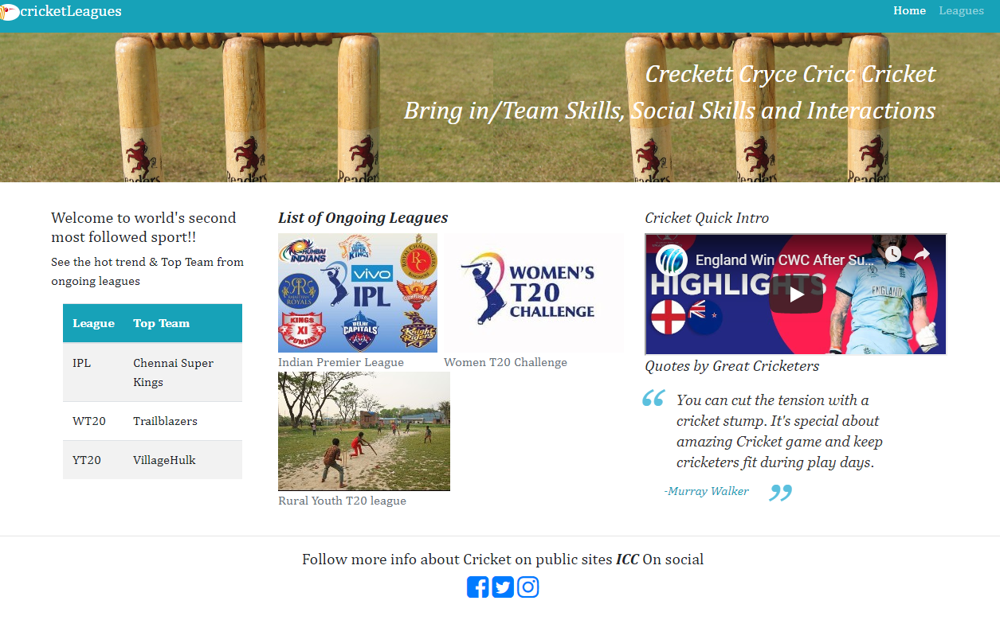

# Cricket Leagues (India)  
##### 2019 Hartcode program (Capstone project)
#### Author : Suriya N Rajamani

Website URL: http://localhost:8081/index.html

## Purpose:
Helps to execute cricket leagues by registering teams under different leagues, managing participating teams, team members.
Provides education on cricket sport and promotes it among kids.

# Audience:
- Primary: Cricketers from various countries and states of applicable ages.
- Secondary: Education of cricket games and promoting them to strangers to cricket game.

## Single Page App
## Home page
- Links to Leagues site and brief note on Cricket sport. Logo of the site with picture. 
- Reader board(Rankings), short video about cricket game and Cricketer quotes

## Leagues and Teams Search Section
- Options to search league by leagues from the dropdown list. Upon selection, it lists down the list of teams under the selected league from ongoing leagues.
- Teams result will have link to show team details, Team changes and list team members.
- Provides an option to register new team by selecting league dropdown from team registration section.

## Team Details Section
- Lists down the Team details with registered Team members for the selected team and league from league search page.
- Provides link to through team member section with the option of add or edit or delete team members .

## Team Register Section
- Helps teams to register by entering the required details such as Team Name, League, manager name and manager email.

## Team Member Section
- Pop up option to edit or add or delete team members for the selected team from team details section.

## Server setup and start
This assumes that the user has Node.js installed globally on their machine.

##### Installing the Express framework into the application and setting up the folders:
- First, clone or copy project from GitHub down to a folder on your machine
- Your folder setup should look like this (folder is an example):

###### Main Folder:
C:>cricketLeagues place the server.js under here

###### subfolders under cricketLeagues:
data (where the JSON data files would be placed) public (this is your "root" directory)

###### subfolders under public: 
css(your styles.css) images (any images) scripts (your js scripts other than server.js)
- Go to your command prompt
- Under your folder for the application, install the Express framework using NPM by typing:
npm install express --save
- Then you'd install the body-parser package using NPM by next typing:
npm install body-parser --save
- once setup is complete, please execute below in cmd prompt under root directory
node server.js

## Reporting issues
Use [Github Issues section for this repository](https://github.com/Suriya1785/cricketLeagues/Issues) to report any issues with the notes.

Examples of the kind of issues that may need reporting:
+ Typos
+ Code samples not working as described
+ Broken or moved links
+ Etc.

# Credits
- content provided by [icc](https://www.icc-cricket.com/about/), [wiki](http://www.wiki.com), [iplt20](https://www.iplt20.com), [dpextra](https://www.dpextra.com/ipl-team-captain-schedule-points-table-matches-timing-result/),[amzon.co.uk](https://www.amazon.co.uk/Print-Victorian-Cricket-Century-14557811/dp/B0799ZDKBQ),[espncricinfo](https://www.espncricinfo.com/).